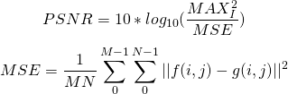
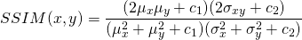

# Project proposal

## Problem

Low-dose CT quality enhancement with deep learning

### Problem definition

CT is an X-ray based imaging technique, which obtains multiple 2D images and then reconstructs them using specific reconstruction algorithms.
Image quality in CT is connected to the number of slices and the power of X-ray (dose). However, the amount of ionizing radiation is pretty high,
and can be dangerous for human. We can obtain target images from low-dose CT procedure, but such images contain noise and can present difficulties in detection of abnormalities.

### Goal

In this project, the goal is to apply deep learning, particularly CNNs,
to the problem of noise reduction in low-dose CT images.

## Data

CT, or computed tomography, is an imaging procedure which captures multiple scans from different angles and then produces a set of tomographic (cross-sectional) slices using specific processing algorithms. CT is widely used in medical imaging for screening and detecting diseases. In this project, I will focus on abdomen CT images. An example of such CT image is shown below.

  

CT images are often taken after injection of contrast, which highlights specific targets in the human body. Different contrasts require different wait times; these are called phases. More details are [here](https://en.wikipedia.org/wiki/Contrast_CT).

### Data preparation

Low-dose CT images usually contain much more noise. Some papers describe this noise as quantum noise, so the problem of noise removal in this project can be also described as a modelling of noise. To augment the data, I can find CT images taken with normal dose and then apply some kind of random noise, which should be similar in nature to the noise presented in real scans.

Also, I can utilize patches instead of whole images. This would solve the problem of different image size (when combining multiple data sources), increase the amount of data samples and reduce the memory requirements since the input size will be smaller.

### Data sources

- Low Dose CT Grand Challenge ([details](https://www.aapm.org/GrandChallenge/LowDoseCT/#))
  - 10 anonymous patients
  - 6,000 CT images
  - pairs of normal dose scans and simulated quarter-dode scans (by inserting Poisson noise)
  - need to request the data from the organizers because the challenge is closed
- Combined Healthy Abdominal Organ Segmentation (CHAOS) ([details](https://chaos.grand-challenge.org/Data/))
  - 40 patients (potential liver donors)
  - average 90 slices per data set (minimum 77, maximum 105 slices)
  - in total 1367 slices for training and 1408 slices for testing
  - 16 bit DICOM images with 512x512 resolution
- DeepLesion ([paper](https://www.spiedigitallibrary.org/journals/journal-of-medical-imaging/volume-5/issue-03/036501/DeepLesion--automated-mining-of-large-scale-lesion-annotations-and/10.1117/1.JMI.5.3.036501.full?SSO=1), [details](https://nihcc.app.box.com/v/DeepLesion/file/306056134060))
  - 32,120 axial CT slices from 10,594 CT scans of 4,427 unique patients
  - bounding boxes and measurements for lesions
  - 16 bit PNG images
- Hospital data
  - recently started working on a similar project with data from a hospital
  - have to request the permission to use the data in this project
  - basically, data is a set of pairs (normal-dose scan, low-dose scan)

## Evaluation

In order to evaluate the models, two metric are commonly used: PSNR and SSIM.

### Peak signal-to-noise ratio (PSNR)

PSNR is ratio between the maximum possible signal value (power) and the power of the noise. It is defined as below:

<!-- $$PSNR = 10 * log_{10}(\frac{MAX_I^2}{MSE})$$
$$MSE = \frac{1}{MN} \sum_0^{M-1} \sum_0^{N-1} ||f(i,j) - g(i,j)||^2$$ -->

  

Logarithmic decibel scale is used because signals have a very wide dynamic range. PSNR is a quantitative measure for comparison of image enhancement algorithms. In general, this is closely related to MSE, so a network architecture trained with MSE loss would also increase PSNR.
  
### Structural similarity index (SSIM)

SSIM is another metric for measuring similarity between a target image and a reference image. It was designed to improve upon PSNR. SSIM is a perceptual metric, which captures structural information. It is defined as below:

<!-- $$SSIM(x,y) = \frac{(2\mu_x\mu_y + c_1)(2\sigma_{xy} + c_2)}{(\mu_x^2 + \mu_y^2 + c_1)(\sigma_x^2 + \sigma_y^2 + c_2)}$$ -->

  

SSIM is usually calculated on a window of a specific size NxN.

## Models

During the current literature review, I have found multiple papers which use Generative Adversarial Network (GAN) architecture to improve the quality of low-dose CT images. Those methods use different version of GAN, e.g. Wasserstein GAN. I will also apply autoencoders and quantitatevly compare the results with GAN architectures.

The first network architecture that I have chosen to experiment with is Super-Resolution GAN (SRGAN).
